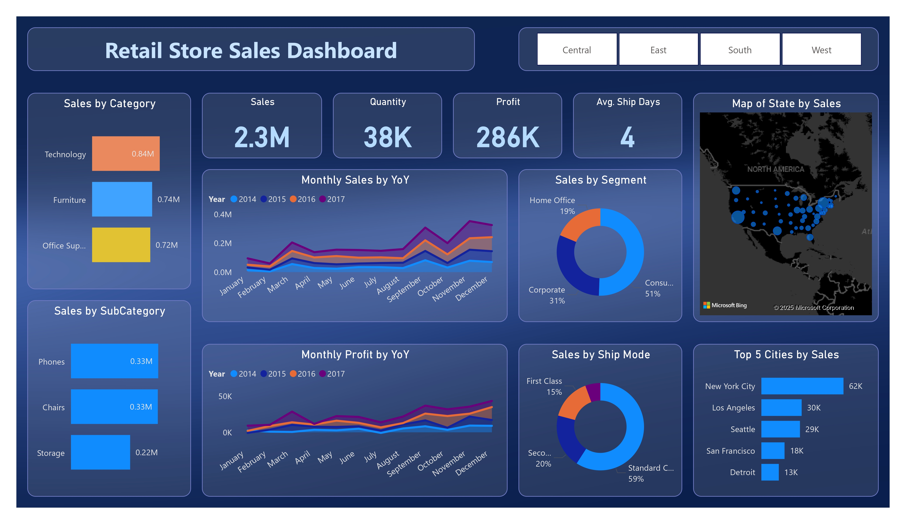

# 📊 Regional Performance Analysis – Power BI Dashboard

This is my first self-driven data analysis project, where I built a dashboard to analyze and compare regional sales and profitability using the **Sample Superstore** dataset. The goal was to identify performance gaps and insights across Central, East, South, and West zones in the US.

## 🖼 Dashboard Preview

## 🔍 Project Objective

- Clean and transform sales data using Power Query
- Identify high and low performing regions
- Extract actionable insights for each zone
- Practice visual storytelling through Power BI dashboards

## 🛠 Tools & Technologies

- Power BI (for dashboard design)
- Power Query (for transformation and data cleaning)
- CSV Dataset: [Sample Superstore](https://www.kaggle.com/datasets/vivek468/superstore-dataset-final)

## 📈 Dashboard Highlights

- Interactive region slicer for performance comparison
- KPIs like total sales, profit, and top cities per zone
- Visuals for customer segments and product categories

### ✨ Key Insights

- **Central**: $501.2K sales, $40K profit – Detroit leads the region
- **East**: $678.8K sales, $92K profit – Dominated by New York City
- **South**: $391.7K sales, $47K profit – Led by Atlanta
- **West**: $725.5K sales, $108K profit – Strongest in Los Angeles
- **Overall**: Technology is the most profitable category at $0.84M

## 💡 What I Learned

- Power Query for transformation logic
- Designing insightful dashboards from raw data
- Presenting a compelling data story from region-wise benchmarks

## 🔗 How to Use

1. Clone the repository
2. Open the `.pbix` file in Power BI Desktop
3. Interact with slicers to explore each region

---

## 🤝 Let’s Connect

If you're exploring data analytics or working on beginner projects, feel free to connect. I’d love to learn and grow together. Feedback is always appreciated!
